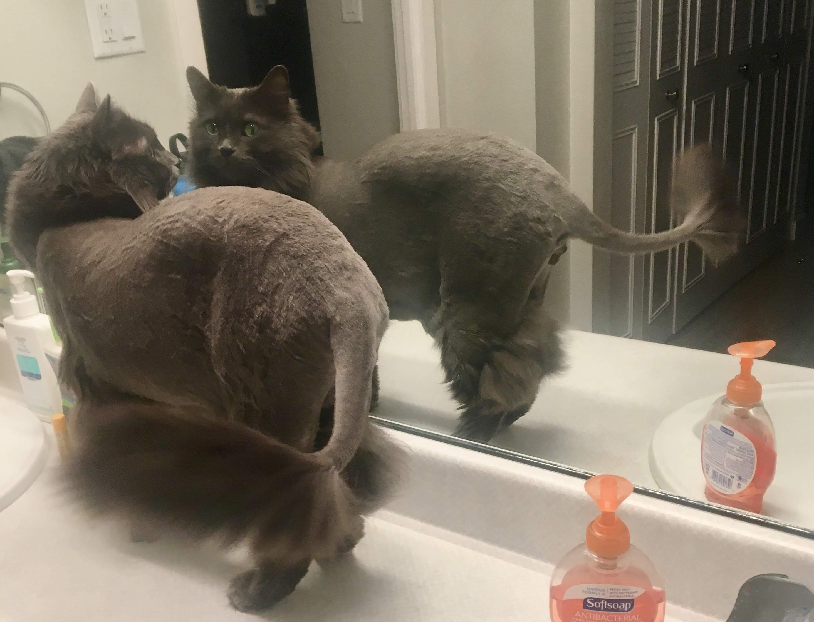
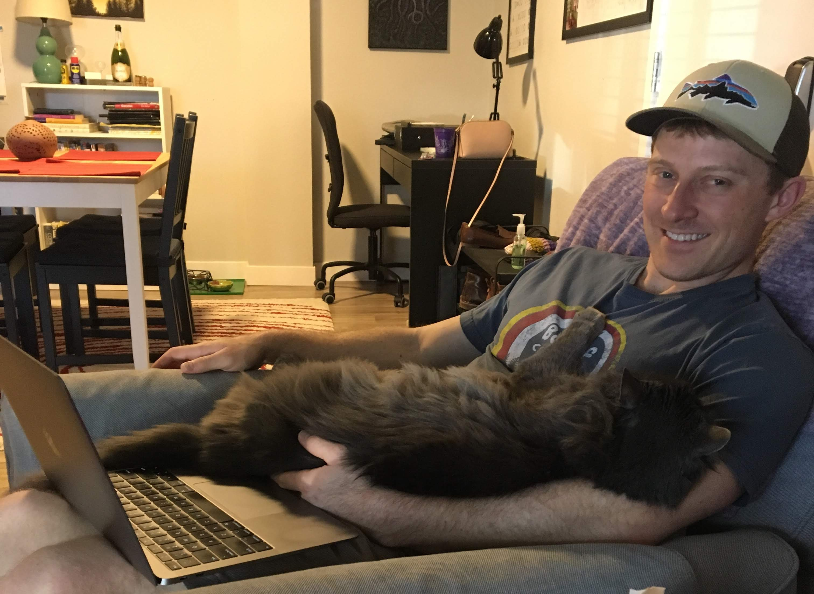

```{r setup, include=FALSE}
knitr::opts_chunk$set(echo = FALSE)
```
# Other links

[Running log](misc.html)

[Amateur art](page.html)

# Cauchy


This is Cauchy, named for [this guy](https://en.wikipedia.org/wiki/Augustin-Louis_Cauchy), and yes, he has a heavy tail. I adopted him as a kitten from a shelter on my birthday several years ago. Words Cauchy currently responds to are his name (and also variants "Cauch" and "Mr. Cauch"), "foods", "treats", and "drugs" (catnip). 







