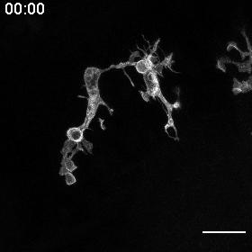

```{r setup, include=FALSE}
knitr::opts_chunk$set(echo = FALSE)

```

```{r}
library(distill)
```


```{r, out.width=400, fig.align='center'}


```

<center><font size="2"> Microglia in live larval zebrafish brain (UV glutamate uncaging at time & position </br> indicated by closed circle; time in minutes; optic tectum)</font> </center>


# Quick links + contact

[CV](CV_2023.pdf)

[Google Scholar](https://scholar.google.com/citations?hl=en&user=wRo5MvAAAAAJ&view_op=list_works&sortby=pubdate)

[ORCID](https://orcid.org/0000-0003-3922-7045)


[LinkedIn](https://www.linkedin.com/in/alexandria-hughes-phd/)


[Twitter](https://twitter.com/alexnhughes?lang=en)

[Redbubble art shop](https://www.redbubble.com/people/alexandglia/shop?asc=u)
  
# 

Content on my website is licensed under a <a rel="license" href="http://creativecommons.org/licenses/by-nc-sa/4.0/">Creative Commons Attribution-NonCommercial-ShareAlike 4.0 International License</a>.


