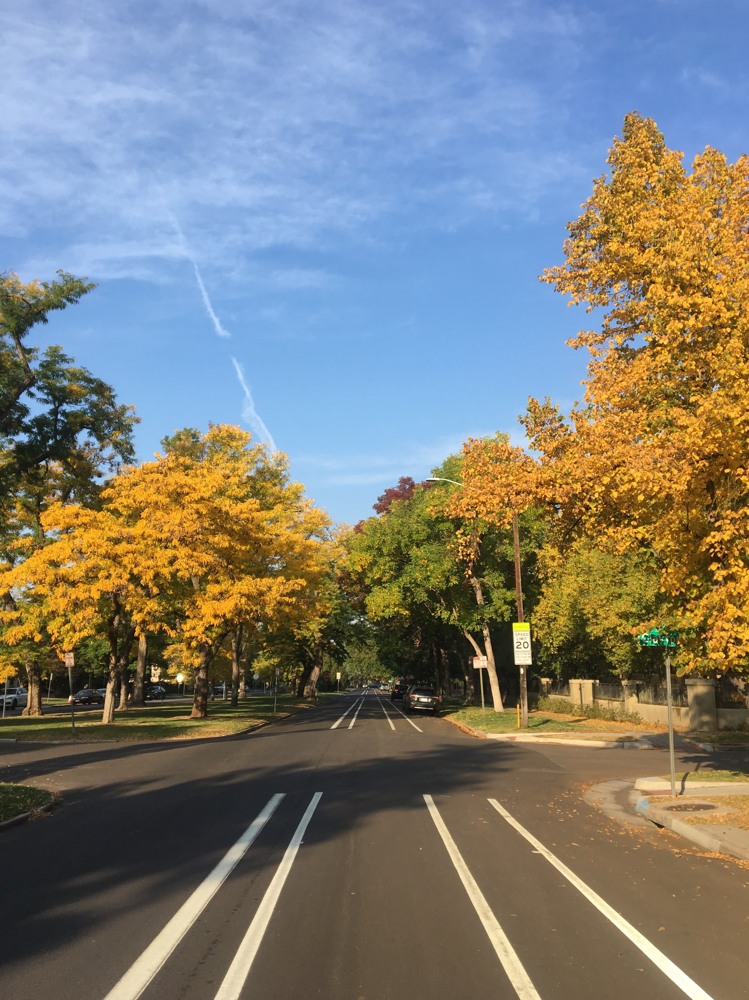
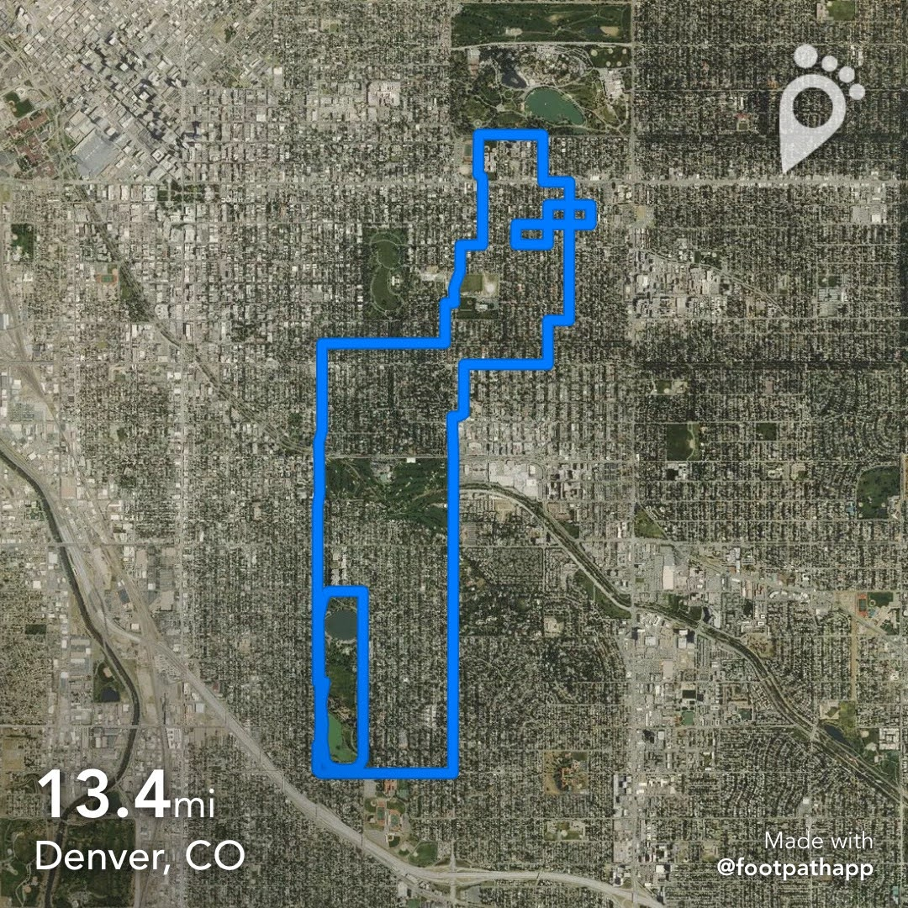
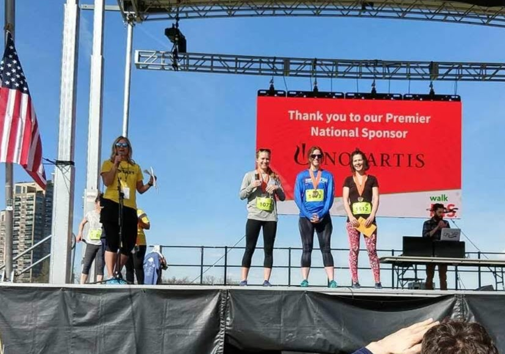

```{r setup, include=FALSE}
knitr::opts_chunk$set(echo=FALSE, R.options = list(width = 60))
```




Running is an outlet and it's important to me that I keep it fun. I don't wear a watch (prefer perceived effort) and instead map distances post-run with [Footpath](https://footpathapp.com/), which I highly recommend.



## Miles

I started tracking weekly distances mid-2018, so I now have two full years of run data (2019, 2020). A neat thing about building this site with R is that I can easily show and plot these data. Here are some weekly data:


```{r message=FALSE}
library(tidyverse)
library(cowplot)
library(kableExtra)

theme_set(theme_cowplot(font_size =18))
```


```{r}
running <- read_csv('annualmpw.csv')
showrun <- as.data.frame(running) 
```
```{r}
#Fantastic html tables with kableExtra, 
#check out https://cran.r-project.org/web/packages/kableExtra/vignettes/awesome_table_in_html.html

kbl(showrun) %>%
  kable_paper()%>%
  scroll_box(height = "120px")
  
```

  
And plotted. I'm surprised at how similar my annual total was between 2019 and 2020, since I waited until the end of the year to check the total and I was pretty sure I cut back a little bit this year (can sort of see it around week 25?). 
  

```{r}
running_long <- running %>% 
  pivot_longer(!week, names_to = "year", values_to = "miles")
```
    
    
```{r}
ggplot(running_long, aes(x=week, y=miles, color=year))+
  scale_color_manual(values = c("#fc7b6d", "#05354b", "#008080"))+
  geom_line(span=0.2, na.rm=TRUE)+
  geom_point(size=3, alpha=0.6, na.rm=TRUE)+
  theme(legend.position = "top")+
  labs(x="week 1 - 52", y="miles/week") 
```


```{r}
annual_miles <- running %>%
  summarize(`total 2019` = sum(miles_2019), 
            `total 2020` = sum(miles_2020),
            `YTD` = sum(miles_2021, na.rm=TRUE))

as.data.frame(annual_miles) %>%
  kbl() %>%
  kable_paper()
```
## Racing

I don't race often (and most races were canceled last year). Still, I have a hard time keeping track of the outcomes when I do race, so I'm keeping PRs here. 

* 5k PR: 20:15 (6:53 min/mi), 5/4/2019 National MS Society 5K at City Park, Denver, CO. 1st F / 4th overall.
* 10k PR: 42:39 (6:52 min/mi), 12/7/2019 Santa Stampede in Littleton, CO.
* 10 mile: 1:13:49 (7:23 min/mi), 1/25/2019 Frosty's Frozen 5 and 10 at Hudson Gardens in Littleton, CO. 4th F.
* Half marathon: 1:36:05 (7:20 min/mi), 2/22/2020 Snowman Stampede at Hudson Gardens in Littleton, CO. 4th F.
* Full marathon? TBD!




