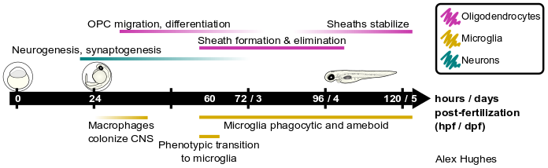
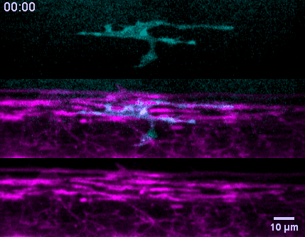

```{r setup, include=FALSE}
knitr::opts_chunk$set(echo = FALSE)
```

# Overview

I used zebrafish to investigate development and function of glial cells of the central nervous system. Zebrafish are small, transparent vertebrates that develop quickly. Here is one at 24 hours post-fertilization (hpf). I labeled the heart with green fluorescent protein.  

  
  
    


# Graduate research

I did my graduate training in Bruce Appel's lab at the University of Colorado Anschutz Medical Campus and defended my PhD in Neuroscience in September 2020. I pursued two separate projects in the lab: in the first, I investigated the localization and function of synaptic proteins in oligodendrocytes, and in the second I discovered that microglia prune myelin sheaths during development. 

* **Hughes AN** & Appel B (2019). Oligodendrocytes express synaptic proteins that modulate myelin
sheath formation. *Nature Communications*, 10(1), 1-15.
  + [Paper link](https://www.nature.com/articles/s41467-019-12059-y)
  + [PDF](hughes-appel-2019.pdf)

* **Hughes AN** & Appel B (2020). Microglia phagocytose myelin sheaths to modify developmental
myelination. *Nature Neuroscience*, 23, 1055–1066.
  + [Paper link](https://www.nature.com/articles/s41593-020-0654-2)
  + [PDF](hughes-appel-2020.pdf)
  
* **Hughes AN** (2021). Glial cells promote myelin formation and elimination. *Frontiers in Cell and Developmental Biology*, 9, 661486.
  + [Paper link](https://doi.org/10.3389/fcell.2021.661486)
  + [PDF](frontiers.pdf)

* I had the opportunity to write a blog piece for The Node about the story behind the microglia story, [Retracting sheaths & words](https://thenode.biologists.com/retracting-sheaths-and-words/highlights/)

* Open Box Science invited to me give a presentation on the microglia paper, which is available to view on [Youtube](https://youtu.be/f1qDUl5YwQo)


* [My dissertation](dissertation-hughes.pdf)




 

# Previous work & undergraduate research

During my first year of graduate school, I wrote a journal club-style review about the relationship between Schwann cells and motor neuron axon arborization with my peers Alison Hixon and Megan Josey.

* **Hughes AN**, Hixon AM, Josey M (2016). A Schwanncentric View of Axon Arborization in Neuromuscular
Junction (NMJ) Formation. *Journal of Neuroscience*, 36(38), 9760-9762.
  + [PDF](hughes-hixon-josey2016.pdf)

I performed undergraduate research in Julie Oxford's lab at Boise State University. Julie's lab studies collagens, a family of extracellular matrix proteins produced by chondrocytes during long bone development. My research project investigated how the minor fibrillar collagen chain encoded by *Col11a1* functions in the endoplasmic reticulum (ER) of chondrocytes during development. During my time in the lab, I wrote two reviews about ER unfolded protein response (UPR) signaling, one in the context of bone development and the other in the context of liver development (with consultation from Dr. Kristen Mitchell, also at BSU).

* **Hughes AN**, Oxford A, Tawara K, Jorcyk C, Oxford JT (2017). Endoplasmic reticulum stress and
unfolded protein response in cartilage pathophysiology; contributing factors to apoptosis and osteoarthritis.
*International Journal of Molecular Sciences*, 18(3), 665.
  + [PDF](hughes-et-al-2017.pdf)

* **Hughes AN** & Oxford JT (2014). A lipid-rich gestational diet predisposes offspring to nonalcoholic
fatty liver disease. *Hepatic Medicine*, 6, 15-23.
  + [PDF](hughes-oxford-2014.pdf)

